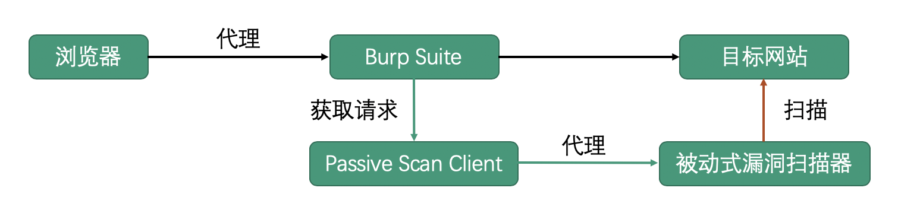

# Passive Scan Client | Burp被动扫描流量转发插件


## 0x01 插件简介

```
Q1: 将浏览器代理到被动扫描器上，访问网站变慢，甚至有时被封ip，这该怎么办？
Q2: 需要人工渗透的同时后台进行被动扫描，到底是代理到burp还是被动扫描器？
Q3: ......
```

该插件正是为了解决该问题，将`正常访问网站的流量`与`提交给被动扫描器的流量`分开，互不影响。



## 0x02 插件编译

```
mvn package
```

## 0x03 插件演示

可以通过插件将流量转发到各种被动式扫描器中，这里我选`xray`来演示.


## 0x04 一些被动式漏洞扫描器
* [GourdScanV2](https://github.com/ysrc/GourdScanV2)  由ysrc出品的基于sqlmapapi的被动式漏洞扫描器
* [xray](https://github.com/chaitin/xray) 由长亭科技出品的一款被动式漏洞扫描器
* [w13scan](https://github.com/boy-hack/w13scan) Passive Security Scanner (被动安全扫描器)
* [Fox-scan](https://github.com/fengxuangit/Fox-scan) 基于sqlmapapi的主动和被动资源发现的漏洞扫描工具
* [SQLiScanner](https://github.com/0xbug/SQLiScanner) 一款基于sqlmapapi和Charles的被动SQL注入漏洞扫描工具
* [sqli-hunter](https://github.com/zt2/sqli-hunter) 基于sqlmapapi，ruby编写的漏洞代理型检测工具
* [passive_scan](https://github.com/netxfly/passive_scan) 基于http代理的web漏洞扫描器的实现