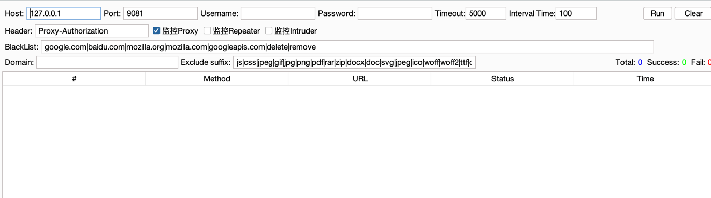

# Passive Scan Client | Burp被动扫描流量转发插件


## 0x01 插件简介

```
Q1: 将浏览器代理到被动扫描器上，访问网站变慢，甚至有时被封ip，这该怎么办？
Q2: 需要人工渗透的同时后台进行被动扫描，到底是代理到burp还是被动扫描器？
Q3: ......
```

该插件正是为了解决该问题，将`正常访问网站的流量`与`提交给被动扫描器的流量`分开，互不影响。


配置参数
- Host、port 指定被动扫描器地址
- Username、Password、Header 为被动扫描器的 Basic 认证相关
- Timeout 指流量代理到被动扫描器的访问超时时间
- Interval Time 指获取的每个流量直接转发给被动扫描器的间隔时间
- BlackList 不转发的黑名单域名
- Domain 限制只转发的域名
- Exclude suffix 限制转发的流量后缀(ps:插件默认设置了 js、css不转发，但对于被动来说这一块还是要进行敏感信息匹配的)
- Proxy、Repeater、Intruder 要转发流量的模块，默认只转发 Proxy 模块的流量

如果想要转发到多个扫描器，host，port，Username、Pasword、Header 输入中分别以 `,` 分割,并且一一对应
比如 
    Host 中 输入 127.0.0.1,192.168.1.1
    Port 中 输入 9081,9082
这样就会将流量分别转发到 `127.0.0.1:9081` 和 `192.168.1.1:9082`


效果图

## 0x02 插件编译

```
mvn package
```

## 0x03 插件演示

可以通过插件将流量转发到各种被动式扫描器中，这里我选`xray`来演示.


## 0x04 一些被动式漏洞扫描器
* [Jie](https://github.com/yhy0/Jie) 一款开源的全面而强大的漏洞扫描和利用工具。
* [GourdScanV2](https://github.com/ysrc/GourdScanV2)  由ysrc出品的基于sqlmapapi的被动式漏洞扫描器
* [xray](https://github.com/chaitin/xray) 由长亭科技出品的一款被动式漏洞扫描器
* [w13scan](https://github.com/boy-hack/w13scan) Passive Security Scanner (被动安全扫描器)
* [Fox-scan](https://github.com/fengxuangit/Fox-scan) 基于sqlmapapi的主动和被动资源发现的漏洞扫描工具
* [SQLiScanner](https://github.com/0xbug/SQLiScanner) 一款基于sqlmapapi和Charles的被动SQL注入漏洞扫描工具
* [sqli-hunter](https://github.com/zt2/sqli-hunter) 基于sqlmapapi，ruby编写的漏洞代理型检测工具
* [passive_scan](https://github.com/netxfly/passive_scan) 基于http代理的web漏洞扫描器的实现